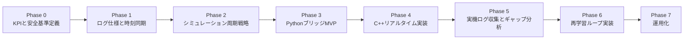
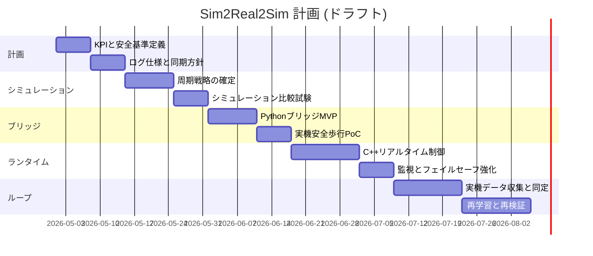

# Sim2Real2Sim 実装計画書
プロジェクト: Genesis Go2 Sim2Real2Sim
版数: 0.1 (ドラフト)
最終更新日: YYYY-MM-DD
責任者:
レビュアー:

---

## 1. 目的と背景
### 1.1 目的
- Genesisで学習した移動Policyを実機Go2へ安全に適用する。
- 実機ログを収集し、シミュレーションと再学習へ還流する。
- 再現可能なSim2Real2Simループを確立する。

### 1.2 背景
- 現在のGenesis locomotion設定は20ms周期の制御更新を前提としている。
- SDKの低レベル制御サンプルは2ms周期のコマンド送信で動作する。
- 主なギャップは周期不一致、観測不一致、遅延、センサノイズである。

### 1.3 成功条件
- 実機で安定かつ安全な連続歩行ができる。
- 再学習サイクル後にKPI改善が定量的に確認できる。
- 手順書に基づきエンドツーエンドのループを再現できる。

---

## 2. スコープ
### 2.1 対象範囲
- シミュレーション周期戦略 (2ms物理と20ms方策の役割分離)
- 実機ブリッジ (Policy推論とLowCmd/LowStateの接続)
- 実機ログ収集と再学習パイプライン
- 安全機構 (停止条件、モード遷移、ウォッチドッグ)

### 2.2 対象外
- 初日からの全面的な最適化
- 全地形・全動作への網羅対応
- 高度なGUI運用ツール整備

### 2.3 前提条件
- 既存のGo2モデルチェックポイントをベースラインとして利用する。
- SDK接続とネットワーク接続が事前に確立している。
- 安全な試験エリアと運用上の安全管理が確保されている。

---

## 3. ロードマップ概要

---

## 4. フェーズ計画
### 4.1 Phase 0: KPIと安全基準
目的:
- 実装前に成功条件を固定する。

主タスク:
- KPIを定義する (転倒率、追従誤差、安定動作時間、温度/電流制限)。
- 強制停止条件を定義する。
- 実験中止条件を定義する。

成果物:
- KPI定義ドキュメント
- 安全運用ルール

完了条件:
- 関係者レビューで承認済みである。

実装記録:

| 日付 | 担当 | 概要 | 結果 | リンク/コミット | 次アクション |
|---|---|---|---|---|---|
| | | | | | |

---

### 4.2 Phase 1: ログ仕様と時刻同期
目的:
- 再学習に適したログ基盤を構築する。

主タスク:
- ログスキーマを定義する。
- 指令とフィードバックを単一時刻基準で同期する。
- 欠損データと遅延処理ポリシーを定義する。

必須ログ項目:
- timestamp
- commanded q/dq/kp/kd/tau
- measured motor q/dq
- imu quaternion/gyro/acc/rpy
- mode and safety flags
- policy action and command vector

成果物:
- ログ仕様ドキュメント
- 時刻同期の検証レポート

完了条件:
- 連続実行において時系列整合がエンドツーエンドで確認できる。

実装記録:

| 日付 | 担当 | 概要 | 結果 | リンク/コミット | 次アクション |
|---|---|---|---|---|---|
| | | | | | |

---

### 4.3 Phase 2: シミュレーション周期戦略 (2ms計画)
目的:
- シミュレーション時間設計を確定する。

主タスク:
- 2ms物理設定を評価する。
- 20ms方策更新と2msコマンド適用の戦略を定義する。
- 周期変更に伴う報酬と再サンプリング調整を定義する。

設計原則:
- 物理ステップ周期と方策更新周期を分離する。
- 初期段階では安定性優先で方策更新を20msに維持する。
- 高速コマンドループへは保持または補間でマッピングする。

成果物:
- 周期戦略仕様書
- ベースライン設定との比較レポート

完了条件:
- 設計がレビュー承認済みである。

実装記録:

| 日付 | 担当 | 概要 | 結果 | リンク/コミット | 次アクション |
|---|---|---|---|---|---|
| | | | | | |

---

### 4.4 Phase 3: PythonブリッジMVP
目的:
- 実機接続の最小実装を短期間で成立させる。

主タスク:
- Policy推論ループ (50Hz) を実装する。
- コマンド送信ループ (2ms) を実装する。
- LowState購読と観測再構築を実装する。
- 最小限の非常停止と安全チェックを追加する。

成果物:
- PythonブリッジMVP
- 実機接続と安全試験のレポート

完了条件:
- 立位、低速歩行、安全停止が再現可能である。

実装記録:

| 日付 | 担当 | 概要 | 結果 | リンク/コミット | 次アクション |
|---|---|---|---|---|---|
| | | | | | |

---

### 4.5 Phase 4: C++リアルタイムランタイム
目的:
- 実機制御経路を堅牢なリアルタイム実装へ移行する。

主タスク:
- C++制御ランタイムを構築する。
- ウォッチドッグとフェイルセーフを強化する。
- ジッタ計測とランタイム診断を追加する。

成果物:
- C++ランタイム実装
- リアルタイム性能レポート

完了条件:
- 長時間運転で周期要件と安全要件を満たす。

実装記録:

| 日付 | 担当 | 概要 | 結果 | リンク/コミット | 次アクション |
|---|---|---|---|---|---|
| | | | | | |

---

### 4.6 Phase 5: 実機ログ収集とギャップ同定
目的:
- シミュレーションと実機のギャップを定量化する。

主タスク:
- 追従遅れ、ノイズ、ドリフトを分析する。
- 関節ごとの誤差統計を作成する。
- ゲイン感度を評価する。

成果物:
- ギャップ同定レポート
- ドメインランダム化候補リスト

完了条件:
- 同定パラメータを再学習へ投入できる状態になる。

実装記録:

| 日付 | 担当 | 概要 | 結果 | リンク/コミット | 次アクション |
|---|---|---|---|---|---|
| | | | | | |

---

### 4.7 Phase 6: 再学習ループ
目的:
- 実機データを還流しモデル性能を改善する。

主タスク:
- データ前処理パイプラインを実装する。
- 再学習フローを接続する。
- ベースラインに対する再学習モデル評価を実施する。

成果物:
- 再学習ワークフロー
- KPIの前後比較レポート

完了条件:
- 対象タスクにおいてKPIがベースラインを上回る。

実装記録:

| 日付 | 担当 | 概要 | 結果 | リンク/コミット | 次アクション |
|---|---|---|---|---|---|
| | | | | | |

---

### 4.8 Phase 7: 運用化
目的:
- 再現可能で保守可能な実行体制を確立する。

主タスク:
- 実験テンプレートを標準化する。
- 設定と結果のバージョン管理ルールを定義する。
- 定期レビューの運用サイクルを確立する。

成果物:
- 運用プレイブック
- 実験管理テンプレート

完了条件:
- 複数オペレーターが同手順で再現できる。

実装記録:

| 日付 | 担当 | 概要 | 結果 | リンク/コミット | 次アクション |
|---|---|---|---|---|---|
| | | | | | |

---

## 5. 横断リスク管理表
| ID | リスク | 影響度 | 対策 | 担当 | 状態 |
|---|---|---|---|---|---|
| R-01 | ループジッタ過大 | High | C++リアルタイム経路と監視導入 |  | Open |
| R-02 | モード競合 | High | 明示的な状態機械とガード導入 |  | Open |
| R-03 | ログ欠落または破損 | Medium | 再送、チェックサム、検証ルール |  | Open |
| R-04 | 非常停止遅延 | High | 二重経路の非常停止処理 |  | Open |

---

## 6. 意思決定ログ
| 日付 | 議題 | 決定事項 | 根拠 | 担当 |
|---|---|---|---|---|
| | | | | |

---

## 7. 課題管理
| ID | タイトル | 優先度 | 担当者 | 期限 | 状態 | 備考 |
|---|---|---|---|---|---|---|
| | | | | | | |

---

## 8. チェックリスト
### 8.1 実験前
- 非常停止の動作確認完了
- テストエリアの安全確認完了
- ログ保存先の確認完了
- モデルと設定ハッシュの記録完了

### 8.2 実験後
- ログ完全性チェック完了
- KPI算出完了
- インシデント記録更新完了
- 次アクション登録完了

---

## 9. 改訂履歴
| 版数 | 日付 | 作成者 | 変更内容 |
|---|---|---|---|
| 0.1 | YYYY-MM-DD |  | 初版ドラフト作成 |

---
